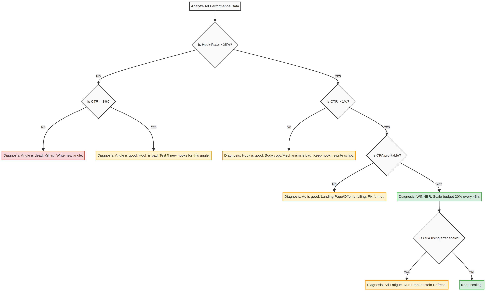

# Creative Strategy Decision Trees

These visual flowcharts dictate the exact decisions to make at every stage of the creative process, from ideation to iteration.

## 1. The Hook Decision Tree
*Use this when deciding which of the 8 Viral Hook Formulas to use for a specific angle.*

## 2. The Format Decision Tree
*Use this when deciding how to visually execute your winning script.*

## 3. The Iteration Decision Tree
*Use this when looking at Meta Ads Manager data to decide your next move.*

