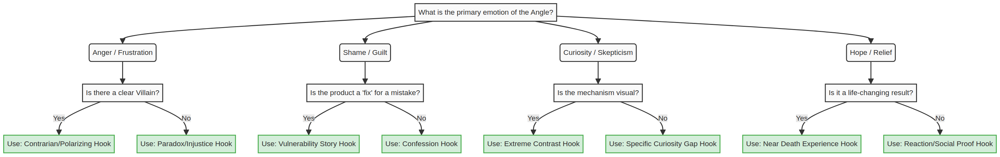
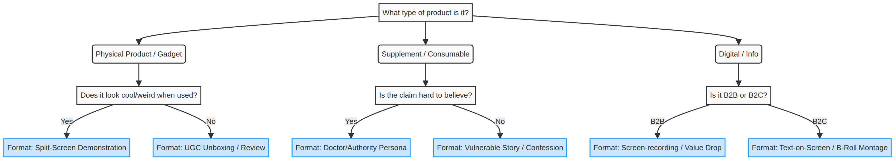

# Creative Strategy Decision Trees

Two visual flowcharts for the two key creative decisions: which hook formula to use, and which ad format to use.

## 1. The Hook Decision Tree
*Use this when deciding which of the 8 Viral Hook Formulas to use for a specific angle.*

## 2. The Format Decision Tree
*Use this when deciding how to visually execute your winning script.*

